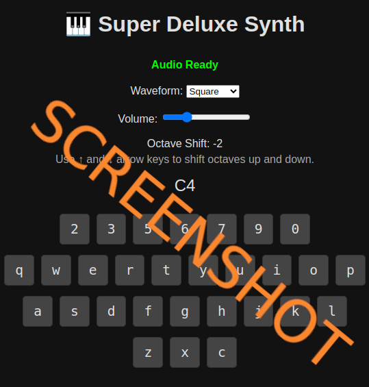

# js_keyboardsynth

# 🎹 Web Audio Synthesizer

🔧 **Definition**  
A polyphonic software synthesizer implemented entirely in JavaScript, leveraging the Web Audio API for real-time audio synthesis. It does not use any pre-recorded audio samples, instead generating sound entirely from oscillators and gain nodes in real time.

## Play it now: https://pemmyz.github.io/js_keyboardsynth/

## Screenshots

### Game

---

🧠 **Key Features**

- **Oscillator-Based Sound Generation**  
  Uses built-in waveform types (`sine`, `square`, `sawtooth`, `triangle`) from the `OscillatorNode`.

- **Polyphony with Oscillator Pooling**  
  Supports multiple simultaneous notes (polyphony) by maintaining pools of oscillators per key.

- **ADSR Envelope (Attack/Release)**  
  Simplified envelope control using attack (`attackTime`) and release (`releaseTime`) parameters.

- **Live User Interaction**  
  Keyboard and mouse/touch input for note triggering, with sustain pedal and octave shift features.

- **Dynamic Control**  
  - Change waveform in real time  
  - Adjust master volume  
  - Shift octaves

- **Real-Time Frequency Modulation**  
  Octave shifts are applied by multiplying the base frequency using a power-of-two relationship.

- **Visual Feedback**  
  Shows which note is being played and highlights keys on interaction.

---

🧩 **Tech Stack**

- **Platform**: Web (runs in-browser)  
- **API**: Web Audio API  
- **UI**: HTML + CSS (assumed), interactive via DOM events  
- **Programming Language**: JavaScript

---

🔊 **Summary**  
A Web Audio API-based, real-time synthesizer that generates sound using oscillators without any audio samples. It supports polyphonic playback, live waveform and volume changes, and dynamic user input — all in the browser.
